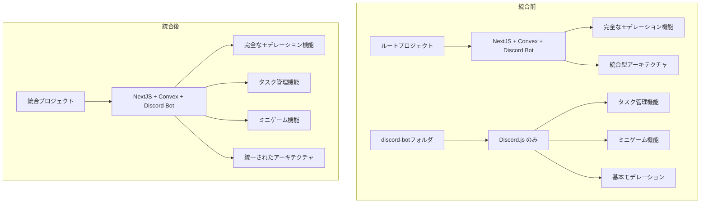

# 設計書

## 概要

2つのDiscord botプロジェクトの統合を行います。ルートプロジェクトは完全なモデレーション機能を持つ統合型アーキテクチャ（NextJS・Convex・クラウド連携含む）で、discord-botフォルダは基本的なDiscord.jsのみの軽量構成です。統合により、重複を排除し、全ての機能（モデレーション、タスク管理、ミニゲーム）を統一されたアーキテクチャで提供します。

## アーキテクチャ

### 統合前後の構造比較



### 統合戦略

1. **Phase 1: 機能分析と移行計画**
   - discord-bot内の機能を詳細分析
   - ルートプロジェクトとの差分を特定
   - 移行優先度を決定

2. **Phase 2: 機能統合**
   - タスク管理機能をルートsrcに統合
   - ミニゲーム機能をルートsrcに統合
   - 設定ファイルの統合

3. **Phase 3: 構造最適化**
   - discord-botフォルダの削除
   - 設定ファイルの統一
   - テストケースの保持

## コンポーネントと インターフェース

### 統合対象機能の詳細分析

#### 1. タスク管理機能

**既存実装場所**: `discord-bot/src/`
- `types/task.ts`: 完全な型定義（Task, TaskCreateRequest, TaskUpdateRequest等）
- `services/taskService.ts`: Notion API連携サービス
- `services/notionClient.ts`: Notion クライアント
- `commands/task.ts`: Discord コマンド実装

**統合先**: `src/`
- 既存の同名ファイルと比較・統合
- Notion API機能の保持
- 型定義の統一

#### 2. ミニゲーム機能（Hit&Blow）

**既存実装場所**: `discord-bot/src/`
- `types/game.ts`: ゲーム状態管理型定義
- `services/gameManager.ts`: ゲーム状態管理サービス
- `utils/gameLogic.ts`: ゲームロジック
- `commands/hitblow.ts`: Discord コマンド実装
- `config/gameSettings.json`: ゲーム設定

**統合先**: `src/`
- 既存ファイルとの差分統合
- ゲーム状態の永続化
- 統計機能の保持

#### 3. 共通機能

**既存実装場所**: `discord-bot/src/`
- `services/commandRegistry.ts`: コマンド登録サービス
- `utils/validation.ts`: バリデーション機能
- `utils/permissionChecker.ts`: 権限チェック機能
- `types/discord.ts`: Discord関連型定義

**統合方針**:
- 機能の重複確認
- より完全な実装を採用
- 設定の統一

### 統合後のディレクトリ構造

```
プロジェクトルート/
├── src/                          # 統合されたDiscord Bot機能
│   ├── commands/                 # Discord コマンド
│   │   ├── hitblow.ts           # ミニゲーム（統合）
│   │   ├── task.ts              # タスク管理（統合）
│   │   └── modtest.ts           # モデレーションテスト
│   ├── services/                # サービス層
│   │   ├── moderation/          # モデレーション機能（既存）
│   │   ├── taskService.ts       # タスク管理サービス（統合）
│   │   ├── notionClient.ts      # Notion API（統合）
│   │   ├── gameManager.ts       # ゲーム管理（統合）
│   │   └── commandRegistry.ts   # コマンド登録（統合）
│   ├── utils/                   # ユーティリティ
│   │   ├── ConfigManager.ts     # 設定管理（既存）
│   │   ├── gameLogic.ts         # ゲームロジック（統合）
│   │   ├── validation.ts        # バリデーション（統合）
│   │   └── permissionChecker.ts # 権限チェック（統合）
│   ├── types/                   # 型定義
│   │   ├── moderation.ts        # モデレーション型（既存）
│   │   ├── task.ts              # タスク管理型（統合）
│   │   ├── game.ts              # ゲーム型（統合）
│   │   ├── discord.ts           # Discord型（統合）
│   │   └── index.ts             # 型エクスポート（統合）
│   ├── config/                  # 設定ファイル
│   │   ├── moderationRules.json # モデレーション設定（統合）
│   │   └── gameSettings.json    # ゲーム設定（統合）
│   ├── scripts/                 # スクリプト
│   │   └── registerCommands.ts  # コマンド登録（統合）
│   └── index.ts                 # メインエントリーポイント
├── app/                         # NextJS アプリケーション（既存）
├── lib/                         # 共有ライブラリ（既存）
├── convex/                      # Convex設定（既存）
├── TEST.md                      # テストケース（新規作成）
└── [discord-botフォルダ削除]
```

## データモデル

### 統合される型定義

#### タスク管理型（統合対象）

```typescript
// src/types/task.ts（統合版）
export interface Task {
  id: string;
  title: string;
  priority: TaskPriority;
  deadline?: Date;
  creator: string;
  status: TaskStatus;
  createdAt: Date;
  updatedAt: Date;
}

export interface NotionConfig {
  token?: string;
  taskDbId?: string;
  isEnabled: boolean;
}
```

#### ゲーム型（統合対象）

```typescript
// src/types/game.ts（統合版）
export interface GameState {
  id: string;
  channelId: string;
  answer: string;
  participants: string[];
  attempts: GameAttempt[];
  status: GameStatus;
  startTime: Date;
  lastActivity: Date;
}

export interface PlayerStats {
  totalGames: number;
  wins: number;
  averageAttempts: number;
  bestScore: number;
}
```

### 設定ファイル統合

#### モデレーション設定（統合）

```json
// src/config/moderationRules.json（統合版）
{
  "rules": [
    {
      "level": 1,
      "words": ["ばか", "あほ", "うざい"],
      "action": "warn"
    },
    {
      "level": 2,
      "words": ["死ね", "殺す", "消えろ"],
      "action": "delete"
    },
    {
      "level": 3,
      "words": ["クソ野郎", "ゴミ人間"],
      "action": "timeout",
      "timeoutDuration": 600000
    }
  ],
  "settings": {
    "logRotationSize": 10485760,
    "exemptRoles": [],
    "exemptChannels": [],
    "defaultTimeoutDuration": 600000,
    "administratorNotificationChannel": null
  }
}
```

#### ゲーム設定（統合）

```json
// src/config/gameSettings.json（統合版）
{
  "maxParticipants": 10,
  "timeoutMinutes": 30,
  "digitCount": 4,
  "allowDuplicateDigits": false,
  "recruitmentTimeMinutes": 5
}
```

## エラーハンドリング

### 統合プロセスのエラー対応

1. **ファイル競合エラー**
   - 同名ファイルの内容比較
   - より完全な実装を採用
   - 必要に応じて手動マージ

2. **依存関係エラー**
   - package.json の統合
   - 重複依存関係の解決
   - バージョン競合の解決

3. **設定ファイル競合**
   - 設定項目の統合
   - デフォルト値の統一
   - Railway環境変数の適用

4. **型定義競合**
   - インターフェースの統合
   - 型の互換性確認
   - 必要に応じて型拡張

### Railway環境対応

1. **環境変数管理**
   - .envファイルを作成しない
   - Railway環境変数を直接参照
   - 開発環境での環境変数設定

2. **デプロイメント設定**
   - railway.json の活用
   - ビルドスクリプトの統一
   - 環境別設定の分離

## テスト戦略

### テストケース保持戦略

#### TEST.md ファイル構成

```markdown
# テストケース

## モデレーション機能テスト
### 警告機能テスト
- レベル1検出語での警告表示
- 警告ログの記録確認

### メッセージ削除テスト
- レベル2検出語での削除実行
- 削除通知の表示確認

### タイムアウト機能テスト
- レベル3検出語でのタイムアウト実行
- 制限通知の表示確認

## タスク管理機能テスト
### タスク作成テスト
- 基本的なタスク作成
- 優先度・期限設定
- Notion API連携確認

### タスク更新テスト
- ステータス変更
- 内容更新
- 削除機能

## ミニゲーム機能テスト
### Hit&Blow ゲームテスト
- ゲーム開始・参加
- 予想入力・結果表示
- 勝利条件・統計記録

## 統合機能テスト
### コマンド登録テスト
- 全コマンドの登録確認
- 権限設定の確認
- エラーハンドリング

### 設定ファイルテスト
- 設定読み込み確認
- デフォルト値適用
- 設定変更の反映
```

### 統合後の検証項目

1. **機能動作確認**
   - 全Discordコマンドの動作
   - モデレーション機能の動作
   - タスク管理機能の動作
   - ミニゲーム機能の動作

2. **統合整合性確認**
   - 設定ファイルの整合性
   - 型定義の整合性
   - 依存関係の整合性

3. **パフォーマンス確認**
   - 起動時間の確認
   - メモリ使用量の確認
   - API応答時間の確認

## 実装詳細

### 統合手順

#### Phase 1: 準備作業

1. **現状分析**
   - 両プロジェクトのファイル差分分析
   - 機能重複の特定
   - 依存関係の確認

2. **バックアップ作成**
   - 重要ファイルのバックアップ
   - Git コミットでの状態保存

#### Phase 2: 機能統合

1. **型定義の統合**
   - `types/` ディレクトリの統合
   - インターフェースの統一
   - 型エクスポートの整理

2. **サービス層の統合**
   - `services/` ディレクトリの統合
   - API クライアントの統合
   - ビジネスロジックの統合

3. **コマンド層の統合**
   - `commands/` ディレクトリの統合
   - Discord コマンドの統合
   - コマンド登録の統合

4. **ユーティリティの統合**
   - `utils/` ディレクトリの統合
   - 共通機能の統合
   - バリデーション機能の統合

#### Phase 3: 設定統合

1. **設定ファイルの統合**
   - JSON設定ファイルの統合
   - デフォルト値の統一
   - 環境別設定の分離

2. **ビルド設定の統合**
   - TypeScript設定の統一
   - package.json スクリプトの整理
   - 依存関係の最適化

#### Phase 4: 清理作業

1. **不要ファイルの削除**
   - discord-bot フォルダの削除
   - 重複ファイルの削除
   - 未使用依存関係の削除

2. **テストケースの作成**
   - TEST.md ファイルの作成
   - 機能別テストケースの整理
   - 検証手順の文書化

### Railway環境対応詳細

#### 環境変数設定

```javascript
// 環境変数の参照方法
const config = {
  discordToken: process.env.DISCORD_TOKEN,
  notionToken: process.env.NOTION_TOKEN,
  notionTaskDbId: process.env.NOTION_TASK_DB_ID,
  // .envファイルは作成しない
};
```

#### デプロイメント設定

```json
// railway.json（既存）
{
  "build": {
    "builder": "NIXPACKS"
  },
  "deploy": {
    "startCommand": "npm run bot:start",
    "healthcheckPath": "/health"
  }
}
```

### パフォーマンス最適化

1. **起動時間の最適化**
   - 不要なインポートの削除
   - 遅延読み込みの実装
   - 設定キャッシュの活用

2. **メモリ使用量の最適化**
   - オブジェクトプールの活用
   - 不要なデータの解放
   - ガベージコレクションの最適化

3. **API応答時間の最適化**
   - 非同期処理の最適化
   - キャッシュ機能の実装
   - バッチ処理の活用

## 要件対応マッピング

### 要件1対応（discord-botフォルダ削除）
- **Phase 4**: discord-botフォルダの完全削除
- **検証**: ルートsrcディレクトリでの機能動作確認
- **清理**: 不要ファイルの削除確認

### 要件2対応（TypeScript設定統一）
- **Phase 3**: tsconfig.json の統合
- **tsconfig.bot.json**: ボット専用設定の活用
- **検証**: ビルドエラーの解消確認

### 要件3対応（package.json統一）
- **Phase 3**: スクリプトの整理と統合
- **依存関係**: 重複依存関係の解決
- **検証**: 全スクリプトの動作確認

### 要件4対応（機能統合）
- **Phase 2**: タスク管理・ミニゲーム機能の統合
- **型定義**: 機能別型定義の統合
- **検証**: 統合後の機能動作確認

### 要件5対応（Railway環境対応）
- **環境変数**: .envファイルを作成しない設計
- **設定管理**: Railway環境変数の直接参照
- **検証**: 開発・本番環境での動作確認

### 要件6対応（機能検証）
- **テスト実行**: 全機能の動作確認
- **統合テスト**: エンドツーエンドテスト
- **検証**: 権限・API接続の確認

### 要件7対応（テストケース保持）
- **TEST.md**: テストケースの文書化
- **機能分類**: 機能別テストケースの整理
- **検証手順**: 検証手順の明文化

### 要件8対応（構造最適化）
- **ディレクトリ構造**: 論理的な構造の実現
- **ドキュメント**: 統合後構造の文書化
- **拡張性**: 将来の機能追加への対応