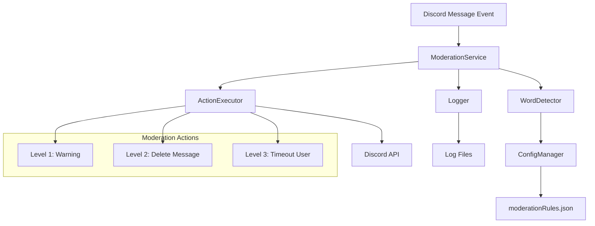
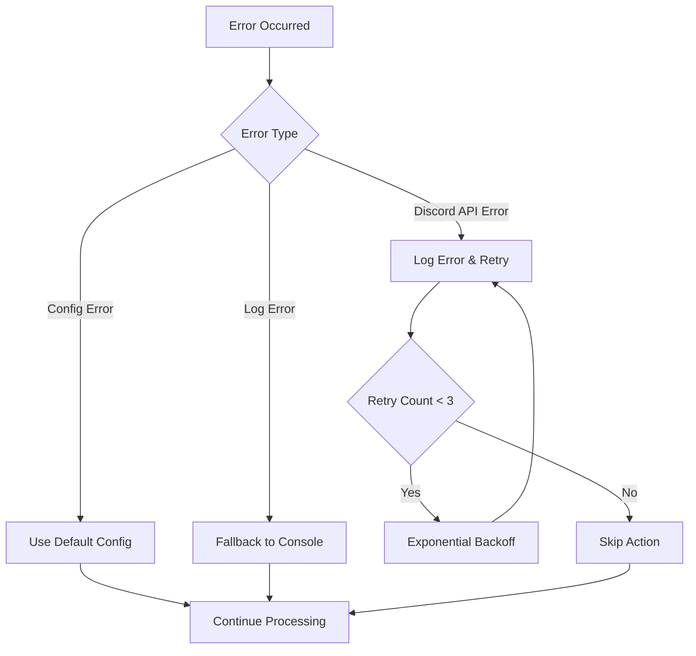

# 設計書

## 概要

自動モデレーション機能は、Discord.jsを基盤とした既存のボットシステムに統合される形で実装されます。メッセージイベントをリアルタイムで監視し、設定可能な検出ワードに基づいて3段階のモデレーション処理（警告、削除、タイムアウト）を自動実行します。

## アーキテクチャ

### システム構成図



### レイヤー構成

1. **イベントハンドラー層**: Discord.jsのMessageCreateイベントを処理
2. **サービス層**: モデレーションロジックの中核
3. **検出層**: 不適切語の検出とレベル判定
4. **実行層**: Discord APIを通じたアクション実行
5. **設定層**: JSON設定ファイルの管理
6. **ログ層**: モデレーション活動の記録

## コンポーネントと インターフェース

### ModerationService

メインのモデレーションサービスクラス

```typescript
interface ModerationService {
  processMessage(message: Message): Promise<void>;
  isExemptUser(user: User): boolean;
  getDetectionResult(content: string): DetectionResult | null;
  reloadConfiguration(): Promise<void>;
}
```

### WordDetector

不適切語の検出を担当

```typescript
interface WordDetector {
  detectInappropriateContent(content: string): DetectionResult | null;
  loadRules(): Promise<void>;
  reloadRules(): Promise<void>;
}

interface DetectionResult {
  level: number;
  detectedWords: string[];
  action: ModerationAction;
  timeoutDuration?: number;
}
```

### ActionExecutor

モデレーションアクションの実行

```typescript
interface ActionExecutor {
  executeWarning(message: Message, detectedWords: string[]): Promise<void>;
  executeDelete(message: Message, detectedWords: string[]): Promise<void>;
  executeTimeout(message: Message, detectedWords: string[], duration: number): Promise<void>;
  notifyAdministrators(error: string, context: ActionContext): Promise<void>;
}

interface ActionContext {
  userId: string;
  messageId: string;
  action: ModerationAction;
  error: string;
}
```

### ConfigManager

設定ファイルの管理

```typescript
interface ConfigManager {
  loadModerationRules(): Promise<ModerationRules>;
  reloadConfig(): Promise<void>;
  validateConfig(rules: ModerationRules): boolean;
}

interface ModerationRules {
  rules: ModerationRule[];
}

interface ModerationRule {
  level: number;
  words: string[];
  action: ModerationAction;
  timeoutDuration?: number;
}
```

### ModerationLogger

ログ記録機能

```typescript
interface ModerationLogger {
  logAction(action: LogEntry): Promise<void>;
  rotateLogFile(): Promise<void>;
}

interface LogEntry {
  timestamp: Date;
  userId: string;
  username: string;
  messageContent: string;
  detectedWords: string[];
  action: ModerationAction;
  level: number;
  success: boolean;
  error?: string;
}
```

## データモデル

### ModerationAction

```typescript
enum ModerationAction {
  WARN = 'warn',
  DELETE = 'delete',
  TIMEOUT = 'timeout'
}
```

### 設定ファイル構造

既存の`moderationRules.json`を拡張：

```json
{
  "rules": [
    {
      "level": 1,
      "words": ["ばか", "あほ", "うざい"],
      "action": "warn"
    },
    {
      "level": 2,
      "words": ["死ね", "殺す", "消えろ"],
      "action": "delete"
    },
    {
      "level": 3,
      "words": ["クソ野郎", "ゴミ人間"],
      "action": "timeout",
      "timeoutDuration": 600000
    }
  ],
  "settings": {
    "logRotationSize": 10485760,
    "exemptRoles": [],
    "exemptChannels": [],
    "defaultTimeoutDuration": 600000,
    "administratorNotificationChannel": null
  },
  "defaultRules": [
    {
      "level": 1,
      "words": ["spam", "test"],
      "action": "warn"
    }
  ]
}
```

### ログファイル形式

```json
{
  "timestamp": "2025-01-20T10:30:00.000Z",
  "userId": "123456789012345678",
  "username": "user#1234",
  "messageContent": "不適切なメッセージ",
  "detectedWords": ["不適切語"],
  "action": "delete",
  "level": 2,
  "success": true
}
```

## エラーハンドリング

### エラー分類と対応

1. **設定ファイルエラー**
   - ファイル不存在: デフォルト設定を使用（要件4.3対応）
   - JSON形式エラー: エラーログ出力、デフォルト設定使用（要件4.4対応）
   - 不正な設定値: 警告ログ、該当ルールをスキップ

2. **Discord API エラー**
   - メッセージ削除失敗: エラーログ記録、管理者通知（要件2.4対応）
   - タイムアウト実行失敗: エラーログ記録、管理者通知（要件3.4対応）
   - 権限不足: エラーログ記録、管理者通知
   - レート制限: 指数バックオフでリトライ
   - ネットワークエラー: 3回まで自動リトライ

3. **ログ記録エラー**
   - ログ記録失敗: コンソールにエラー出力（要件5.4対応）
   - ディスク容量不足: コンソール出力に切り替え
   - ファイル権限エラー: 代替ログファイル作成

### エラー処理フロー



## テスト戦略

### 単体テスト

1. **WordDetector テスト**
   - 各レベルの検出語テスト
   - 大文字小文字の処理
   - 部分一致の動作確認

2. **ActionExecutor テスト**
   - モックDiscord APIを使用
   - 各アクションの実行確認
   - エラーハンドリングテスト

3. **ConfigManager テスト**
   - 設定ファイル読み込み
   - バリデーション機能
   - エラー処理

### 統合テスト

1. **メッセージ処理フロー**
   - 実際のDiscordメッセージイベントをシミュレート
   - 各レベルのモデレーション処理確認

2. **設定変更テスト**
   - 設定ファイル更新時の動作確認
   - ホットリロード機能

### パフォーマンステスト

1. **大量メッセージ処理**
   - 同時メッセージ処理能力
   - メモリ使用量監視

2. **検出処理速度**
   - 長文メッセージの処理時間
   - 大量検出語での処理速度

## 要件対応マッピング

### 要件1対応（警告機能）
- **WordDetector**: レベル1検出語の識別
- **ActionExecutor.executeWarning()**: 警告メッセージ表示（1.1対応）
- **ModerationService**: 元メッセージ保持処理（1.2対応）
- **ModerationLogger**: 警告ログ記録（1.3対応）

### 要件2対応（メッセージ削除）
- **WordDetector**: レベル2検出語の識別
- **ActionExecutor.executeDelete()**: メッセージ削除と通知表示（2.1, 2.2対応）
- **ModerationLogger**: 削除ログ記録（2.3対応）
- **ActionExecutor.notifyAdministrators()**: 削除失敗時の管理者通知（2.4対応）

### 要件3対応（ユーザータイムアウト）
- **WordDetector**: レベル3検出語の識別
- **ActionExecutor.executeTimeout()**: 10分間タイムアウト実行（3.1対応）
- **ActionExecutor**: メッセージ削除と制限通知表示（3.2対応）
- **ModerationLogger**: 制限ログ記録（3.3対応）
- **ActionExecutor.notifyAdministrators()**: タイムアウト失敗時の管理者通知（3.4対応）

### 要件4対応（設定ファイル管理）
- **ConfigManager**: 設定ファイル更新時の新検出ワード適用（4.1対応）
- **ConfigManager.loadModerationRules()**: システム起動時の設定読み込み（4.2対応）
- **ConfigManager**: デフォルト検出ワード使用機能（4.3対応）
- **ConfigManager.validateConfig()**: 不正形式時のエラーログ出力とデフォルト設定使用（4.4対応）

### 要件5対応（ログ機能）
- **ModerationLogger.logAction()**: 全モデレーション活動の詳細ログ記録（5.1対応）
- **ModerationLogger**: ログファイルへの永続化（5.2対応）
- **ModerationLogger.rotateLogFile()**: ログローテーション機能（5.3対応）
- **エラーハンドリング**: ログ記録失敗時のコンソール出力（5.4対応）

## 実装詳細

### ファイル構成

```
discord-bot/
├── src/
│   ├── services/
│   │   └── moderation/
│   │       ├── ModerationService.ts
│   │       ├── WordDetector.ts
│   │       ├── ActionExecutor.ts
│   │       └── ModerationLogger.ts
│   ├── utils/
│   │   └── ConfigManager.ts
│   ├── types/
│   │   └── moderation.ts
│   └── config/
│       └── moderationRules.json (既存)
├── logs/
│   └── moderation/
└── tests/
    └── moderation/
```

### 既存システムとの統合

1. **DiscordBotクラス拡張**
   - `lib/discord.ts`のMessageCreateイベントハンドラーを拡張
   - ModerationServiceのインスタンス化と呼び出し
   - システム起動時の設定ファイル読み込み（要件4.2対応）

2. **設定ファイル活用**
   - 既存の`moderationRules.json`を基盤として使用
   - 設定ファイル更新時の動的適用機能（要件4.1対応）
   - 必要に応じて設定項目を追加

3. **ログディレクトリ**
   - プロジェクトルートに`logs/moderation/`ディレクトリを作成
   - 日付別ログファイル管理
   - ログファイルの永続化機能（要件5.2対応）
   - ログローテーション機能（要件5.3対応）

### パフォーマンス考慮事項

1. **メッセージ処理の最適化**
   - 非同期処理によるブロッキング回避
   - 検出処理の効率化（正規表現の事前コンパイル）

2. **メモリ管理**
   - ログのメモリ蓄積防止
   - 設定ファイルのキャッシュ管理

3. **Discord API制限対応**
   - レート制限の監視
   - バッチ処理による API呼び出し最適化